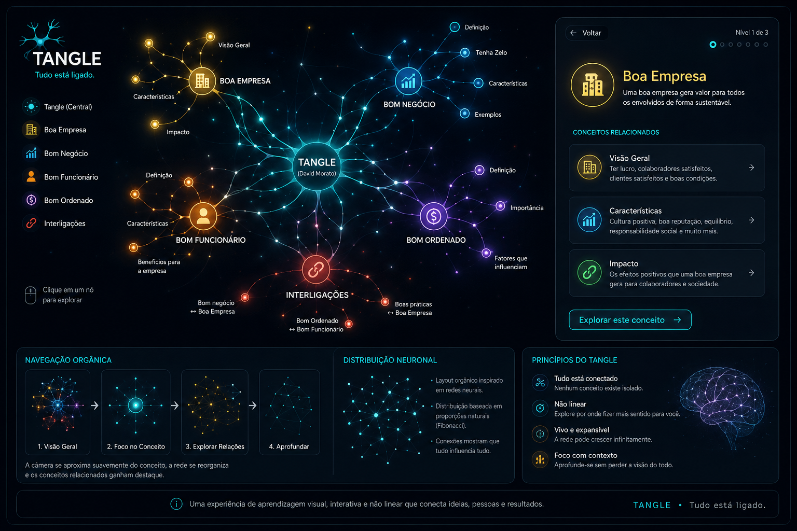
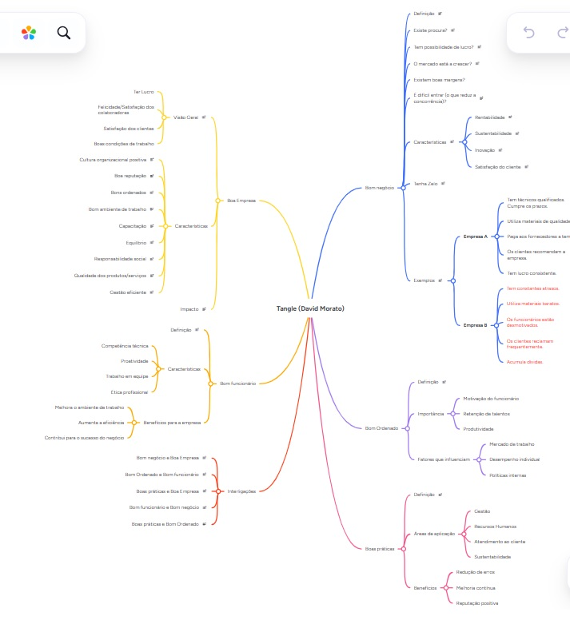

PROJECT.md: visão, arquitetura e objetivos (o documento que acabámos de construir)
# PROJECT.md
# TANGLE
## Tudo Está Ligado

**Versão:** 1.0

**Autor:** David Morato

---

# 1. Introdução

O TANGLE é uma experiência interativa de aprendizagem destinada a colaboradores, empresários, gestores e executivos.

O TANGLE é um grafo de conhecimento navegável, não uma coleção de páginas Markdown

Ao contrário de uma apresentação tradicional, o TANGLE não pretende transmitir conhecimento através de slides ou páginas estáticas.

O objetivo é permitir que o utilizador **descubra conhecimento**, percebendo visualmente que todos os elementos de uma organização estão interligados.

O projeto pretende provocar reflexão.

Não pretende dar respostas prontas.

---

# 2. Missão

Mostrar que uma organização funciona como um organismo vivo.

Nenhuma área existe isoladamente.

Cada decisão influencia várias outras.

Uma boa empresa influencia os colaboradores.

Os colaboradores influenciam os clientes.

Os clientes influenciam o negócio.

O negócio influencia a empresa.

Tudo está ligado.

---

# 3. A Filosofia do TANGLE

A palavra "TANGLE" significa literalmente:

> Entrelaçado.

Essa palavra representa exatamente aquilo que pretendemos transmitir.

O projeto não fala de cinco assuntos separados.

Fala de um único sistema composto por várias partes.

Cada conceito depende dos restantes.

Cada decisão cria consequências.

Cada melhoria produz impacto em toda a organização.

---

# 4. Público-Alvo

O TANGLE foi concebido para ser utilizado em ações de formação dirigidas a:

- Funcionários
- Empresários
- Executivos
- Gestores
- Equipas
- Formadores

Não existe um perfil técnico obrigatório.

Toda a experiência deverá ser intuitiva.

---

# 5. Objetivo Pedagógico

O utilizador deverá terminar a experiência compreendendo que:

Uma boa empresa não existe sem bons colaboradores.

Um bom colaborador dificilmente permanece numa empresa que não valoriza as pessoas.

Um bom negócio depende de ambos.

Boas práticas fortalecem todos os restantes pilares.

Nenhum destes conceitos vive isoladamente.

---

# 6. Conceito Central

Toda a aplicação gira em torno de uma única ideia.

# TUDO ESTÁ LIGADO

Esta frase será o elemento central de toda a narrativa.

Sempre que um conceito for apresentado, deverá ser possível compreender:

- de onde surgiu;
- quem influencia;
- quem é influenciado;
- quais as consequências.

---

# 7. Estrutura Conceptual

O mapa mental está organizado em cinco pilares principais.

## Boa Empresa

Representa aquilo que caracteriza uma organização saudável.

Inclui:

- visão geral;
- características;
- impacto.

---

## Bom Negócio

Representa as características de um negócio sustentável.

Inclui:

- definição;
- perguntas para reflexão;
- características;
- estudo comparativo.

---

## Bom Funcionário

Representa o papel do colaborador.

Inclui:

- definição;
- características;
- benefícios.

---

## Bom Ordenado

Representa a valorização das pessoas.

Inclui:

- definição;
- importância;
- fatores que influenciam.

---

## Boas Práticas

Representa os comportamentos organizacionais.

Inclui:

- definição;
- áreas;
- benefícios.

---

# 8. O Elemento Mais Importante

Existe um sexto conceito.

Não é um capítulo.

É a razão de existir do projeto.

## Interligações

As relações entre os cinco pilares.

Exemplos:

Boa Empresa ↔ Bom Negócio

Bom Funcionário ↔ Bom Ordenado

Boas Práticas ↔ Boa Empresa

Bom Funcionário ↔ Bom Negócio

Boas Práticas ↔ Bom Ordenado

Estas relações são mais importantes do que os próprios capítulos.

---

# 9. Princípios Fundamentais

Durante todo o desenvolvimento deverão ser respeitadas as seguintes regras.

## Regra 1

O utilizador nunca deverá sentir que mudou de página.

Tudo faz parte do mesmo mundo.

---

## Regra 2

O utilizador nunca perde a perceção da rede completa.

Mesmo quando explora um único conceito.

---

## Regra 3

Cada conceito deverá mostrar as suas ligações.

Nunca deverá aparecer isolado.

---

## Regra 4

As animações deverão ter um propósito.

Nunca existirão efeitos apenas por estética.

---

## Regra 5

A tecnologia nunca poderá definir a arquitetura.

A arquitetura define a tecnologia.

---

# 10. Visão da Experiência

O utilizador inicia a experiência.

Não encontra um menu.

Não encontra botões.

Não encontra páginas.

Encontra um organismo vivo.

Uma rede.

Uma estrutura semelhante a um cérebro.

Os conceitos flutuam no espaço.

As ligações respiram.

Existe energia a circular.

Existe profundidade.

Existe movimento.

Existe vida.

O utilizador aproxima-se naturalmente de um conceito.

A rede responde.

As ligações iluminam-se.

Os restantes conceitos continuam presentes.

Nunca desaparecem.

Porque tudo está ligado.

# Conceito Visual

O objetivo estético do projeto é aproximar-se da seguinte referência.

Esta imagem não deverá ser copiada.

Ela serve apenas para comunicar:

- atmosfera
- iluminação
- profundidade
- composição
- sensação de rede viva

---

# 11. O Que o Projeto NÃO É

O TANGLE não é:

- um website institucional;
- um PowerPoint;
- um conjunto de páginas;
- um mapa mental estático;
- um fluxograma;
- uma árvore de menus.

---

# 12. O Que o Projeto É

O TANGLE é:

- uma experiência;
- uma narrativa;
- uma exploração;
- um modelo visual de conhecimento;
- um organismo digital.

---

# Mapa Mental Original

O TANGLE nasceu a partir do seguinte mapa mental.

Este documento representa a origem conceptual do projeto.

Qualquer alteração estrutural deverá respeitar este mapa ou ser documentada em DECISIONS.md.

# Fim da Parte 1

# PARTE 2 — Modelo de Domínio

---

# 13. Modelo de Domínio

Antes de existir qualquer tecnologia, o TANGLE existe como um modelo conceptual.

Este modelo representa conhecimento.

Não representa páginas.

Não representa componentes.

Não representa interfaces.

Todo o software será construído sobre este modelo.

---

# 14. Entidades Fundamentais

O universo do TANGLE é composto por apenas seis entidades.

## 1. Graph

O Graph representa todo o conhecimento.

Existe apenas um Graph.

Ele contém absolutamente tudo.

É o "cérebro" da aplicação.

O Graph conhece:

- todos os Nodes;
- todas as Connections;
- todos os Clusters;
- todos os Estados;
- toda a Timeline.

---

## 2. Node

O Node é a unidade fundamental do sistema.

Tudo é um Node.

Exemplos:

- Boa Empresa
- Bom Negócio
- Bom Funcionário
- Bom Ordenado
- Boas Práticas
- Rentabilidade
- Cultura Organizacional
- Ética
- Sustentabilidade
- Clientes
- Lucro

Tudo isto é um Node.

Nunca existirão elementos especiais.

Todos obedecem às mesmas regras.

---

Cada Node possui:

• Identificador

• Nome

• Descrição

• Categoria

• Cluster

• Relações

• Estado Visual

• Estado Funcional

• Conteúdo

• Perguntas

• Exemplos

• Ligações

---

## 3. Connection

Uma Connection representa uma influência.

Nunca representa apenas uma linha.

Ela responde à pergunta:

"O que este conceito influencia?"

ou

"Quem influencia este conceito?"

As Connections podem possuir:

• direção

• intensidade

• prioridade

• significado

• animação

---

## 4. Cluster

Um Cluster representa um grupo de conhecimento.

Exemplos:

Boa Empresa

Bom Negócio

Bom Funcionário

Bom Ordenado

Boas Práticas

Interligações

Cada Cluster possui vários Nodes.

---

## 5. Journey

A Journey representa a narrativa.

Existem duas formas de exploração.

### Linear

O utilizador segue a ordem definida pelo formador.

---

### Exploratória

O utilizador escolhe qualquer conceito.

A aplicação adapta-se.

---

A arquitetura deverá suportar ambas.

---

## 6. Engine

A Engine é o "coração" do TANGLE.

Não desenha.

Não cria interface.

Não mostra textos.

Apenas controla o comportamento do universo.

Ela controla:

• animações

• estados

• foco

• transições

• timeline

• eventos

---

# 15. Hierarquia Conceptual

A estrutura lógica é:

Graph

↓

Clusters

↓

Nodes

↓

Conteúdo

↓

Perguntas

↓

Exemplos

↓

Relações

---

# 16. Relações

As relações são tão importantes quanto os próprios Nodes.

Toda a aplicação gira em torno delas.

Exemplo:

Boa Empresa

↓

Bom Funcionário

↓

Bom Ordenado

↓

Motivação

↓

Produtividade

↓

Clientes

↓

Lucro

↓

Boa Empresa

O utilizador deverá perceber visualmente este ciclo.

---

# 17. Tipos de Nodes

Nem todos os Nodes têm o mesmo papel.

Existem vários tipos.

## Concept

Representa uma ideia.

Exemplo:

Boa Empresa

---

## Characteristic

Representa uma característica.

Exemplo:

Rentabilidade

Ética

Sustentabilidade

---

## Question

Representa perguntas para reflexão.

Exemplo:

Existe procura?

O mercado cresce?

---

## Example

Representa exemplos.

Empresa A

Empresa B

---

## Conclusion

Representa uma conclusão.

---

## Connection Node

Representa relações entre dois conceitos.

---

# 18. Estados

Todos os Nodes podem assumir estados.

Exemplos:

Dormant

Ainda não explorado.

---

Visible

Está visível.

---

Highlighted

Recebe atenção.

---

Focused

Está a ser estudado.

---

Completed

Já foi explorado.

---

Hidden

Temporariamente invisível.

---

Locked

Ainda indisponível.

---

Unlocked

Pode ser explorado.

---

# 19. Eventos

Todo o universo responde a eventos.

Exemplos:

Hover

Click

Focus

Blur

Scroll

Zoom

Expand

Collapse

Highlight

Activate

Deactivate

Complete

Reset

---

# 20. Fluxo Conceptual

Todo o funcionamento da aplicação segue esta lógica.

Utilizador

↓

Escolhe um Node

↓

Engine recebe o evento

↓

Engine altera os estados

↓

Connections respondem

↓

Camera adapta-se

↓

Conteúdo aparece

↓

Outros Nodes continuam presentes

↓

O utilizador compreende a relação

---

# 21. Princípios Arquiteturais

O software deverá respeitar sempre estas regras.

Regra 1

Nunca duplicar conhecimento.

---

Regra 2

Todo o conteúdo pertence aos Nodes.

Nunca aos componentes.

---

Regra 3

As animações nunca controlam lógica.

---

Regra 4

Os componentes nunca conhecem o projeto inteiro.

Conhecem apenas aquilo que precisam.

---

Regra 5

A Engine controla comportamento.

Os componentes apenas representam esse comportamento.

---

# 22. Resultado Esperado

Quando esta arquitetura estiver implementada corretamente:

• será possível adicionar novos capítulos sem alterar a Engine;

• será possível adicionar novos Nodes sem alterar componentes;

• será possível criar novos percursos de formação reutilizando o mesmo grafo;

• será possível reutilizar a mesma arquitetura para outros treinamentos.

---

# Fim da Parte 2

# PARTE 3 — Arquitetura Técnica

---

# 23. Filosofia da Arquitetura

A arquitetura do TANGLE deverá obedecer a um princípio simples:

> O software existe para representar conhecimento.

Não para representar páginas.

Nem componentes.

Nem frameworks.

Todo o código deverá refletir o modelo de domínio definido na Parte 2.

---

# 24. Camadas da Aplicação

A aplicação divide-se em seis grandes camadas.

────────────────────────────

Experience

↓

Engine

↓

Graph

↓

Content

↓

Presentation

↓

Infrastructure

────────────────────────────

Cada camada possui apenas uma responsabilidade.

---

# 25. Experience

A Experience representa aquilo que o utilizador vê.

É composta por:

• ambiente

• interface

• animações

• iluminação

• navegação

• narrativa

A Experience nunca contém regras de negócio.

---

# 26. Engine

A Engine é o cérebro da aplicação.

É responsável por:

• gerir estados

• responder a eventos

• controlar animações

• controlar a timeline

• controlar o foco

• controlar a progressão

A Engine nunca desenha nada.

Nunca conhece componentes gráficos.

---

# 27. Graph

O Graph representa todo o conhecimento.

É a única fonte de verdade.

Todos os componentes consultam o Graph.

Nunca criam informação própria.

O Graph conhece:

• Nodes

• Connections

• Clusters

• Journey

• Estados

---

# 28. Content

Todo o conteúdo pertence ao domínio.

Nunca pertence aos componentes.

Exemplos:

Boa Empresa

Bom Negócio

Perguntas

Descrições

Exemplos

Reflexões

Imagens

Vídeos

Documentos

Tudo deverá ser armazenado separadamente da interface.

---

# 29. Presentation

A Presentation apenas representa informação.

Não decide comportamento.

Não altera estados.

Não conhece regras.

Recebe dados.

Mostra dados.

---

# 30. Infrastructure

Esta camada contém tudo o que depende da tecnologia utilizada.

Exemplos:

Framework

Renderização

Bibliotecas

Shaders

Gestão de assets

Persistência

Áudio

Qualquer alteração tecnológica deverá ficar confinada a esta camada.

---

# 31. Fluxo de Informação

Todo o fluxo deverá seguir apenas um sentido.

Utilizador

↓

Evento

↓

Engine

↓

Graph

↓

Presentation

↓

Renderização

Nunca o contrário.

---

# 32. Responsabilidades

Cada elemento possui uma única responsabilidade.

Engine

↓

Comportamento

Graph

↓

Conhecimento

Presentation

↓

Visualização

Infrastructure

↓

Tecnologia

---

# 33. Estados Globais

A aplicação possui estados globais.

Exemplos:

Inicialização

Introdução

Exploração

Foco

Reflexão

Conclusão

Cada estado altera o comportamento do universo.

---

# 34. Estados dos Nodes

Cada Node possui dois grupos de estados.

Estado Funcional

• locked

• unlocked

• completed

• active

• inactive

Estado Visual

• visible

• hidden

• highlighted

• selected

• focused

• fading

---

# 35. Timeline

Toda a experiência decorre sobre uma Timeline.

Não é apenas uma sequência de animações.

É uma sequência narrativa.

Exemplo:

Inicialização

↓

Introdução

↓

Rede Principal

↓

Boa Empresa

↓

Bom Negócio

↓

Bom Funcionário

↓

Bom Ordenado

↓

Boas Práticas

↓

Interligações

↓

Conclusão

A Timeline deverá poder ser alterada sem modificar a Engine.

---

# 36. Sistema de Eventos

Todos os acontecimentos da aplicação são eventos.

Exemplos:

mouseenter

mouseleave

focus

blur

activate

deactivate

complete

scroll

zoom

cameraMove

timelineChange

Todos os módulos comunicam através destes eventos.

---

# 37. Sistema de Animação

As animações são consequência dos estados.

Nunca são responsáveis por alterar lógica.

Exemplo:

Estado muda

↓

Engine processa

↓

Presentation recebe

↓

Animação acontece

Nunca:

Animação

↓

Altera estado

---

# 38. Sistema de Câmara

A câmara representa o olhar do utilizador.

Nunca deverá parecer mecânica.

Características pretendidas:

• movimentos suaves

• aproximações orgânicas

• profundidade

• sensação cinematográfica

A câmara faz parte da narrativa.

---

# 39. Sistema de Conteúdo

Cada Node deverá poder conter:

Título

Descrição

Perguntas

Exemplos

Referências

Ligações

Imagens

Vídeos

Documentos

Sem necessidade de alterar qualquer componente.

---

# 40. Escalabilidade

A arquitetura deverá permitir:

Adicionar novos Nodes.

Adicionar novos Clusters.

Adicionar novas ligações.

Adicionar novos capítulos.

Adicionar novos percursos.

Adicionar novos idiomas.

Sem alterar a arquitetura existente.

---

# 41. Regras de Desenvolvimento

Antes de implementar qualquer funcionalidade:

1. Definir o comportamento.

2. Atualizar o modelo de domínio.

3. Atualizar a documentação.

4. Só depois escrever código.

Nenhuma exceção.

---

# 42. Objetivo da Arquitetura

Quando concluída, a arquitetura deverá permitir que o TANGLE evolua durante vários anos.

Novos conteúdos poderão ser adicionados.

Novas tecnologias poderão substituir as atuais.

Novos módulos poderão surgir.

Mas a arquitetura conceptual deverá permanecer estável.

---

# Fim da Parte 3

# PARTE 4 — Roadmap, Convenções e Evolução

---

# 43. Roadmap do Projeto

O desenvolvimento do TANGLE deverá seguir uma ordem lógica.

Nunca deverá começar pela interface.

A ordem correta é:

Modelo de Domínio

↓

Arquitetura

↓

Engine

↓

Experiência

↓

Conteúdo

↓

Refinamento

---

# FASE 1 — Fundação

Objetivo:

Construir a base do universo.

Inclui:

- Modelo de Domínio
- Estrutura do Graph
- Nodes
- Connections
- Clusters
- Journey
- Engine
- Timeline
- Sistema de Estados

Resultado esperado:

Um universo funcional sem qualquer preocupação estética.

---

# FASE 2 — Experiência

Objetivo:

Dar vida ao universo.

Inclui:

- Câmara
- Ambiente
- Partículas
- Luz
- Movimento
- Profundidade
- Navegação

Resultado esperado:

Uma rede viva.

---

# FASE 3 — Conteúdo

Objetivo:

Adicionar conhecimento.

Inclui:

Boa Empresa

Bom Negócio

Bom Funcionário

Bom Ordenado

Boas Práticas

Interligações

Resultado esperado:

Toda a informação do mapa mental disponível.

---

# FASE 4 — Narrativa

Objetivo:

Transformar conhecimento numa experiência.

Inclui:

- Sequência de exploração
- Perguntas
- Reflexões
- Comparações
- Transições

Resultado esperado:

Uma experiência pedagógica.

---

# FASE 5 — Refinamento

Objetivo:

Elevar a qualidade.

Inclui:

- Performance
- UX
- Polimento
- Otimizações
- Acessibilidade

---

# 44. Convenções

Todos os elementos do projeto deverão seguir convenções consistentes.

Nomes claros.

Responsabilidades únicas.

Código previsível.

Nada de duplicação.

---

# 45. Organização

Todo o projeto deverá respeitar esta regra.

Conhecimento

↓

Engine

↓

Interface

Nunca o contrário.

---

# 46. Componentes

Cada componente deverá responder apenas a uma pergunta.

Exemplo:

Node

↓

"Como desenhar um Node?"

Nunca:

"O que significa Boa Empresa?"

Esse conhecimento pertence ao domínio.

---

# 47. Engine

A Engine deverá ser completamente independente da interface.

Idealmente seria possível trocar todo o sistema gráfico mantendo exatamente a mesma Engine.

---

# 48. Conteúdo

O conteúdo nunca deverá estar misturado com código.

Adicionar um novo capítulo deverá significar apenas adicionar novos dados.

Nunca criar novos componentes.

---

# 49. Escalabilidade

O projeto deverá permitir:

Adicionar novos pilares.

Adicionar novos Nodes.

Adicionar novas ligações.

Adicionar novos percursos.

Adicionar novos idiomas.

Adicionar novos treinamentos.

Sem alterar a arquitetura principal.

---

# 50. Performance

A performance faz parte da experiência.

A aplicação deverá transmitir fluidez.

Movimentos suaves.

Transições naturais.

Sem interrupções.

---

# 51. Acessibilidade

A experiência deverá poder ser utilizada por diferentes perfis de utilizadores.

Sempre que possível deverá existir:

- Navegação por teclado
- Contraste adequado
- Legendas
- Conteúdo acessível

---

# 52. Filosofia Visual

O universo TANGLE deverá transmitir:

Organização.

Profundidade.

Elegância.

Vida.

Conhecimento.

Nunca excesso de efeitos.

Cada animação deverá comunicar alguma coisa.

---

# 53. O Papel da Tecnologia

Nenhuma biblioteca deverá definir a arquitetura.

Frameworks mudam.

Linguagens evoluem.

Bibliotecas desaparecem.

O modelo conceptual deverá permanecer.

---

# 54. Definição de Sucesso

O projeto será considerado bem-sucedido quando:

O utilizador compreender naturalmente que:

Boa Empresa

↓

Bom Negócio

↓

Bom Funcionário

↓

Bom Ordenado

↓

Boas Práticas

↓

Influenciam-se mutuamente.

Sem necessidade de explicações longas.

A própria experiência deverá comunicar esta ideia.

---

# 55. Futuras Expansões

A arquitetura deverá permitir:

- Novos capítulos
- Novos temas
- Novos grafos
- Diferentes áreas de negócio
- Diferentes formações
- Diferentes narrativas

Sem reconstruir a aplicação.

---

# 56. Princípios Inegociáveis

Durante todo o desenvolvimento deverão ser respeitados os seguintes princípios:

1. O modelo de domínio é a fonte de verdade.

2. A arquitetura vem antes da implementação.

3. O conhecimento vem antes da tecnologia.

4. O conteúdo nunca pertence aos componentes.

5. A Engine controla comportamento.

6. A interface apenas representa estados.

7. A documentação deve ser atualizada antes de alterar a arquitetura.

8. O projeto deverá evoluir por extensão, nunca por reconstrução.

---

# 57. Visão de Longo Prazo

O TANGLE não deverá ser encarado apenas como um website.

O objetivo é criar uma plataforma capaz de representar conhecimento complexo de forma visual e interativa.

A arquitetura deverá permitir que o mesmo motor seja reutilizado para outros treinamentos, cursos e áreas de conhecimento, bastando alterar o conteúdo e as relações do grafo.

---

# 58. Declaração Final

O TANGLE existe para demonstrar que o conhecimento não é linear.

As organizações são sistemas vivos.

As pessoas influenciam processos.

Os processos influenciam resultados.

Os resultados influenciam pessoas.

A compreensão nasce das relações.

Essa é a essência do projeto.

> **Tudo está ligado.**

---

# Fim do Documento

**PROJECT.md — Versão 1.0**